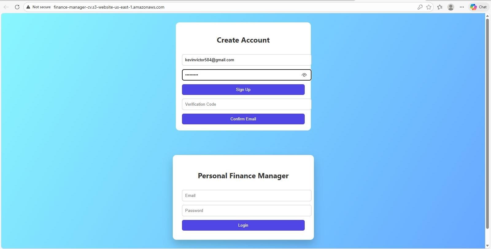
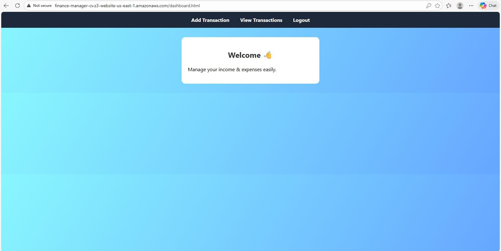
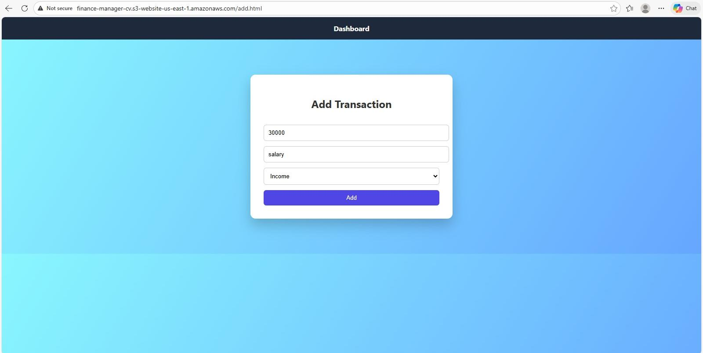
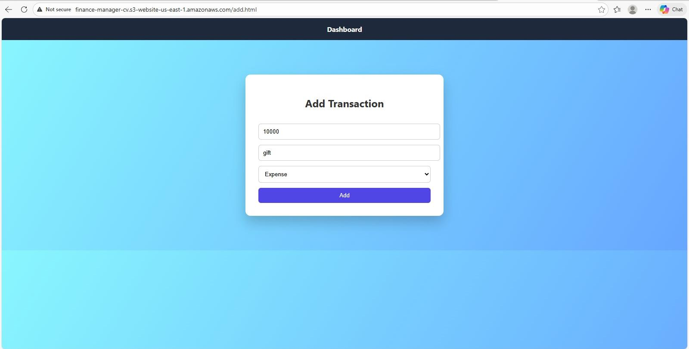
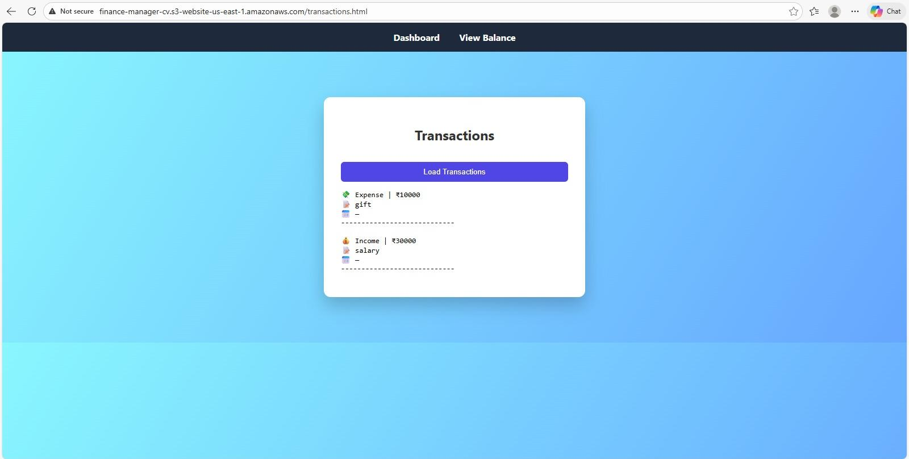
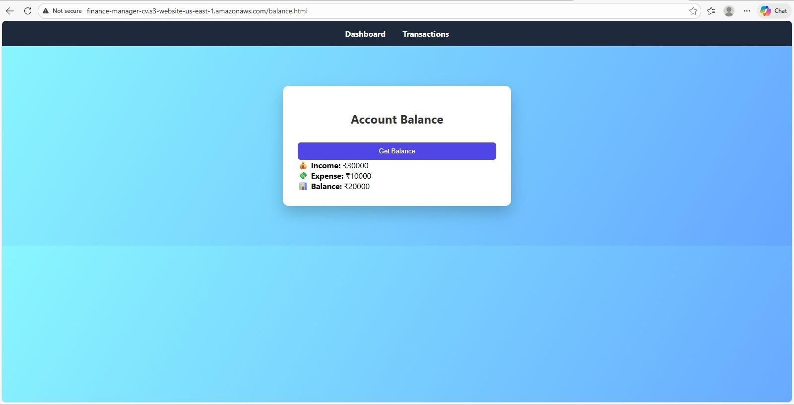
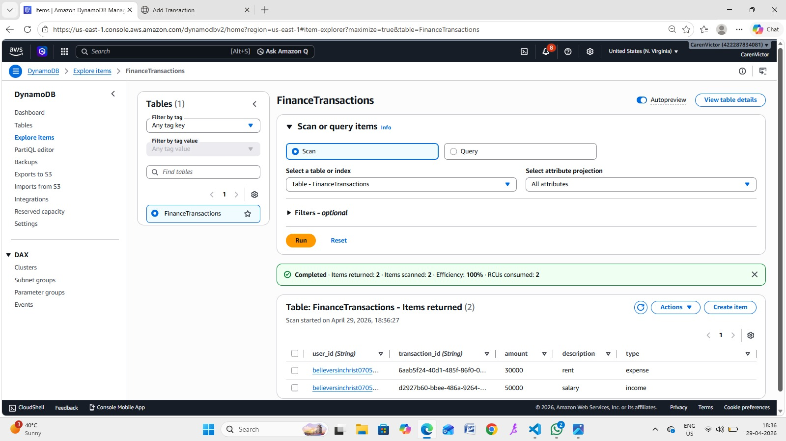
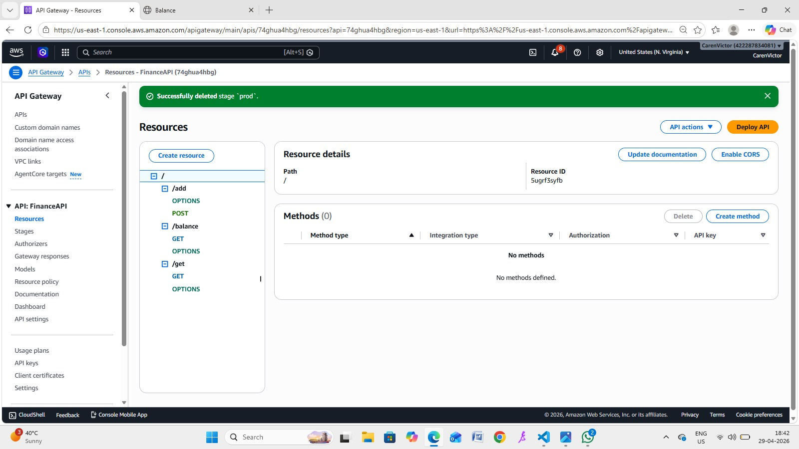
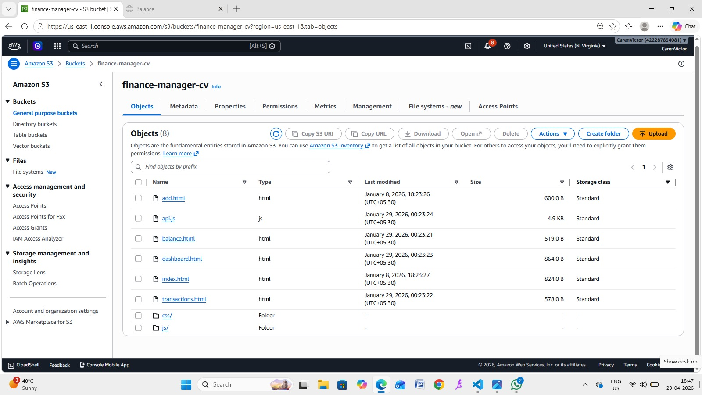

# 💰 Serverless Personal Finance Manager

A fully serverless personal finance management web application built using AWS cloud services. This project allows users to securely manage income and expenses, track balances, and view transaction history through a responsive web interface.

---

# 🚀 Project Overview

This application was designed to demonstrate practical cloud development skills using AWS serverless architecture. The system provides secure authentication, API-based transaction management, and real-time balance tracking without managing traditional servers.

Users can:
- Create an account and log in securely
- Add income and expense transactions
- View transaction history
- Check account balance summary
- Access the application through a hosted static website

---

# 🛠️ Technologies Used

## Frontend
- HTML
- CSS
- JavaScript

## AWS Services
- Amazon S3 (Static Website Hosting)
- AWS Lambda
- Amazon API Gateway
- Amazon DynamoDB
- Amazon Cognito

---

# ☁️ AWS Architecture

```text
User → S3 Hosted Frontend
        ↓
API Gateway
        ↓
AWS Lambda Functions
        ↓
DynamoDB Database

Authentication handled using AWS Cognito
```

---

# 🔐 Authentication

User authentication and authorization are implemented using **Amazon Cognito**.

Features:
- User signup and login
- Token-based authentication
- Protected routes and API access
- Secure session handling using JWT tokens

---

# 📂 Project Structure

```text
finance-manager/
│
├── css/
│   └── style.css
│
├── js/
│   ├── api.js
│   └── auth.js
│
├── index.html
├── dashboard.html
├── add.html
├── transactions.html
├── balance.html
```

---

# ✨ Features

- Secure user authentication
- Add income and expense records
- View transaction history
- Balance calculation
- Responsive UI
- Serverless backend architecture
- Cloud-hosted frontend

---

# 📸 Application Screens

## 🔐 Login & Signup



---

## 🏠 Dashboard



---

## ➕ Add Income Transaction



---

## ➖ Add Expense Transaction



---

## 📋 Transactions History



---

## 💰 Balance Summary



---

# ☁️ AWS Architecture & Services

## 🗄️ DynamoDB Table

The application stores user transactions securely in Amazon DynamoDB.



---

## 🌐 API Gateway Configuration

Amazon API Gateway is used to expose backend APIs for transaction operations.



---

## 📦 Amazon S3 Static Website Hosting

Frontend files are hosted using Amazon S3 Static Website Hosting.



---

# 🧠 Learning Outcomes

Through this project, I gained practical experience in:
- Building serverless applications
- Working with AWS cloud services
- API integration
- Authentication using Cognito
- NoSQL database operations with DynamoDB
- Frontend and backend integration
- Deploying static websites on AWS

---

# ⚡ Challenges Faced

- Managing authentication tokens securely
- Connecting API Gateway with Lambda functions
- Handling CORS and API responses
- Optimizing AWS resource usage and billing

---

# 🔮 Future Improvements

- Data visualization charts
- Monthly analytics dashboard
- Export reports feature
- Mobile responsive enhancements
- Dark mode UI
- Budget planning and alerts

---

# 👩‍💻 Author

**Caren Victor**  
BS-MS in Computer Science  
Cloud & Data Science Enthusiast

GitHub: https://github.com/carenvictor1573

---

# 📌 Note

This project was built for learning and hands-on experience with AWS serverless architecture and cloud-native application development.
